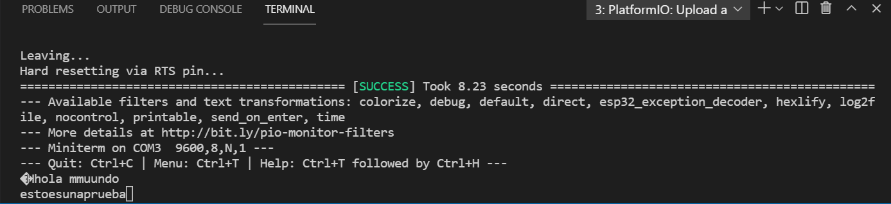

# PRACTICA 8 
Por tal de cumplir los objetivos que nos pide este ejercico de practicas debemos iniciar en el setup dos serial.begin a la misma velocidad que la que tenemos en el monitor_speed en el .ini este comando nos establece la velocidad de datos en bits por segundo para la transmisión de datos en serie. Seguidamente lo que tendriamos que hacer en el bucle loop serian poner dos condiciones if por tal que cuando una de estas serial este activa todo lo que se escriba por la contraria se lea en esta, es decir lo que podremos ver al usarlo es el retardo en escribir las letras ya que la que introduza en ese momento hasta que no se escriba la siguiente no aparecera o se vera de forma tapada. Para su correcto funcionamiento se han de conectar los pines 16,17 de la ESP32 entre ellos. 
Captura de lo observable a traves de la terminal/monitor: 

